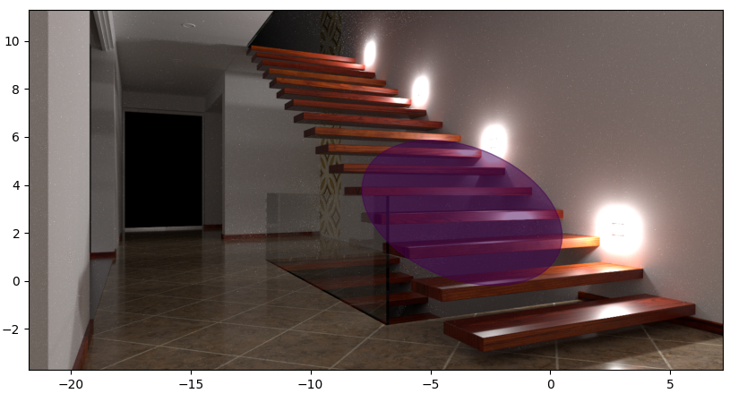
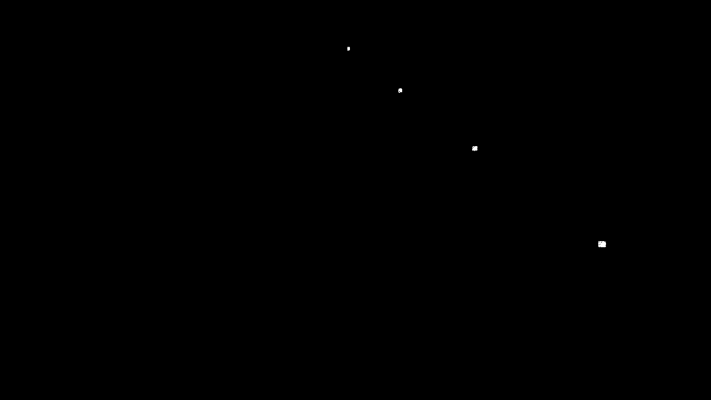

## 27.01
Positives:
- can run program without crashing on -nan values
    - I'm deleting components which have close to 0 contribution
- merging and splitting seems to work fine

Still need fix/investigation:
- minimum and maxium number of components is not respected
- everything behind blocking lock - bad for performance (~4.5 hour render)
    - changing number of components - maybe should have fixed number but "active" and "inactive" like vmm_robus_...
- still not counting in the "contribution" factor (everything with contribution 1)
- doesn't look good at all (nothing learnt?) - collapsed to one component



## Next update: add date
- Doing GMM relearning at every loop does not make sense
- Training iterations :) - finally understand why and implemented here
### TASKS DONE (move tasks from below once completed):
- rendering should stop - DONE!
- training stopping cryterion - on second thought, I don't think we should. - not doing
- merging cryterion - should allow more merging - DONE!
- make sure that we explore the whole line that the ray is on - DONE!
- insead of point center - use exact center of intersection - DONE (i think);
- investigate the ordering of the GMMs - DONE!
- minCompCount is not respected... - DONE!
- active components count is not kept well (honestly is it needed?) - NO, removed
- counting how many times we sampled from gmm - DONE
- why sometimes intersection not found - DONE!
- It would be helpful to draw octree lines as well - DONE!
- timing investigations: - DONE!
    - how much splatting takes - check
    - how much sampling takes - check
    - how does this compare to the vanila sampler - check
### TASKS TO DO (currenlty):
- the tree in the next rendering should be more granual (currently 73 nodes...)
    - investigate adaptivness of the tree
### TASKS TO DO (maybe later on):
- rendering for a certain number of iterations (currenlty for a certain time)
- exporting and importing state
- collecting statistics of how many times sampling from gmm was effective vs pbrt sampling
### Let's sum up how it looks:
- in visualization notebooks

## Next update: 17.03
### Pytania:
- jak mam tłumaczyć Path Guiding
- Spis treści magisterki
- Mgr po angielsku
- Czy to na pewno dobry tytuł (szczególnie część z optymalizacją przestrzeni?)
    - no i efekty lokalne - czy są jakieś efekty lokalne, które by nie były skojarzone z efektem ogniskowej, czy to nie jest zbyt ogólne

### Next update: 31.03:
- Sprawy do zrobienia:
    - kilka iteracji 4spp vs jedna 256spp
    - czemu to tak wolno mieli (przecież zdaje się, że mały dodatek obliczeń)
    - MIS vs 100%
    - jak zainicjalizowanie wpływa na GMM (randomowo, uniform, itd itd)
    - z adaptacją drzewa vs bez adaptacji
    - serializacja drzewa


- Zaadresowane sprawy:
    - dlaczego po lewej stronie modern-hall mamy próbki
        - bo duża biała ściana z mocno odbijającego materiału:
            ```
            <bsdf type="twosided" id="Wall" >
                <bsdf type="diffuse" >
                    <rgb name="reflectance" value="0.893289, 0.893289, 0.893289"/>
                </bsdf>
            </bsdf>
            ```
            

